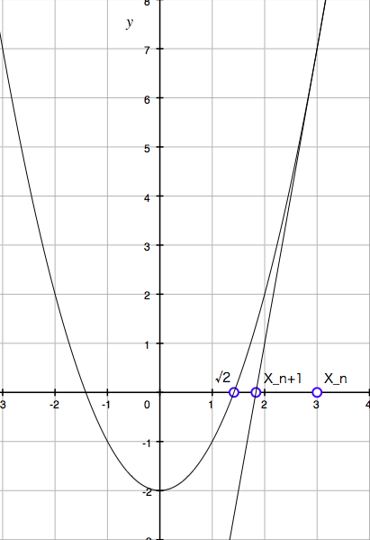

1.1.7 例: Newton 法による平方根
=====================================

原文では `x` と `y` で説明がなされているが, 私たちは学校教育で `x` は変数で `a` が定数と慣らされているので, ここでは文字を変えて説明していることに留意いただきたい.

平方根の関数は :math:`\sqrt{\mathstrut a} = x \geq 0 かつ x^2 = a` であるような `x` と定義できる.
しかしこの定義に沿って Lisp に書き起こしても平方根の問題は解けない.
なぜならこの定義は手続きではないからである.

数学では **それが何であるか** を記述する, 一方計算機科学では **それをどうするか** を記述する.
手続きでは **それをどうするか** を記述しなければ問題の解とならない.
計算機科学では一般的に **アルゴリズム** と呼ばれる繰り返し処理を記述することによって問題を解く.

さて平方根を解くという問題はどうやって解決するのだろうか？平方根を解くための有力な手法は Newton 法である.
Newton 法では数 `a` の平方根の値の予測値を `x` としたとき, `x` と :math:`a/x` の平均値をとるという計算で真値に近い次の予測値を得られる.

ではなぜこのアルゴリズムで平方根が得られるのか説明しよう.

:math:`y = x^2 - 2` を例に以下の手順を取る. (グラフを参照)

| :math:`f(x) = x^2 - 2` とする
| :math:`x = x_n` における f(x) の接線の方程式 g(x) を求める
| g(x) = 0 の点 :math:`x_{n+1}` を求める
| :math:`x_n` と :math:`x_{n+1}` に関する漸化式を導出する

| 接線の方程式は g(x) - f(x_n) = f'(x_n)(x - x_n) なので
| :math:`g(x) - (x_n^2 -2) = 2x_n(x - x_n)`
| :math:`g(x) = 2x_n x - x_n^2 - 2`
| :math:`0 = 2x_n x_{n+1} - x_n^2 - 2`
| :math:`x_{n+1} = \frac{1}{2} (x_n + \frac{2}{x_n})`

以上により次の予測値を得るには :math:`x` と :math:`a/x` の平均値をとるという計算によって得られることが分かった.

.. code-block:: scheme

   (define (sqrt-iter guess x)
     (if (good-enough? guess x)
         guess
         (sqrt-iter (improve guess x)
                    x)))

   (define (improve guess x)
     (average guess (/ x guess)))

   (define (average x y)
     (/ (+ x y) 2))

   (define (good-enough? guess x)
     (< (abs (- (square guess) x)) 0.001))

sqrt のプログラムは単純な手続きで数値計算を行うことができる.
さらにはここではプログラミングにおいてループ構文と呼ばれる構文は使っていないことも驚きである.
sqrt-iter は通常の手続き呼び出しがあれば特別な構文なしで反復を実行することができる.
(反復により効率が気になるところであるが 1.2.1 節の末尾再帰でその説明がなされる.)
