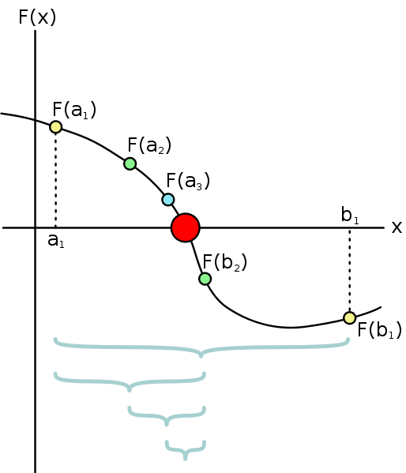
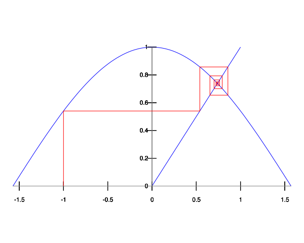

1.3.3 一般的方法としての手続き
==========================================

=================
本節の目的
=================

下記の 2 つの例を用いながら更に強力な抽象化の手法を学ぶ.

- 区間二分法による方程式の零点の探索
- 関数の不動点の探索

==========================================
区間二分法による方程式の零点の探索
==========================================

区間二分法(Half-Interval Method) とは連続関数 f に対して :math:`f(x) = 0` の根を探す場合に有用な手法のひとつである.

2 点 a, b が :math:`f(a) < 0 < f(b)` を満たす時, f は a と b との間に少なくとも 1 つの零点を持つ.

まず :math:`f(a) < 0`, :math:`0 < f(b)` を満たす a, b を用意する. 
二分法を繰り返し, ある許容誤差(T) より小さい時解とする.

図で示すように, このアルゴリズムのステップ数は,

解となる n 回目において, :math:`\frac{L}{2^n} = T` が成り立つとすると, :math:`n = log \frac{L}{T}` となり, ステップ数は a と b の差である L と許容誤差 T に依存することが分かる.

.. sourcecode:: scheme
    
    (define (search f neg-point pos-point)
      (let ((midpoint (average neg-point pos-point)))
        (if (close-enough? neg-point pos-point)
            midpoint
            (let ((test-value (f midpoint)))
              (cond ((positive? test-value)
                     (search f neg-point midpoint))
                    ((negative? test-value)
                     (search f midpoint pos-point))
                    (else midpoint))))))

search 手続きは, 引数に探索対象の関数 f と, a, b に相当する neg-point, pos-point を引数に受け取り, 解を返す.

==========================================
関数の不動点の探索
==========================================

ある x において :math:`f(x) = x` を満たす時, x は f の不動点(Fixed-Point)と呼ぶ.
不動点の探索は, ある予測値をまず設定し, f を繰り返し作用させ値がある許容誤差以内になった値を解とする.

.. sourcecode:: scheme

    (define (fixed-point f first-guess)
      (define (close-enough? v1 v2)
        (< (abs (- v1 v2)) tolerance))
      (define (try guess)
        (let ((next (f guess)))
          (if (close-enough? guess next)
              next
              (try next))))
      (try first-guess))

fixed-point 手続きは, 引数に探索対象の関数 f と初期の予測値を引数に受け取り解を返す.

これを用いて, 例えば :math:`cos(x) = x` となる x の値を `(fixed-point cos 1.0)` を計算することで求められる.

不動点探索には平均緩和法が有用である
---------------------------------------------------

ここで, ある実数 a における平方根 :math:`\sqrt{a}` を考えよう. :math:`\sqrt{a}` とは, :math:`y^2 = a` を満たす y の値を探すことと同意である.

即ち,

| :math:`y^2 = a`
| :math:`y = \frac{a}{y}`
| このとき
| y は :math:`y \mapsto \frac{a}{y}` の不動点を探索する, と言う.
| 
sqrt は以下のように定義でき, 手続きを追ってみる.

.. sourcecode:: scheme

    (define (sqrt x)
      (fixed-point (lambda (y) (/ x y))
                   1.0))

- (fixed-point (lambda (y) (/ x y)) 1.0))
- (try 1.0)
- (f 1.0) ;; => (lambda (y) (/ x y))
- (try 1.0)
- (f 1.0) ;; => (lambda (y) (/ x y))

無限ループになり解を導出できない.

この解決策として **平均緩和法(Average Damping)** がある. 
平均緩和法は予測値の大きな変化を防ぐことで, 解への逐次近似値を平均化する方法で,
不動点探索で収束を助ける有用な方法のひとつである. 

| :math:`y^2 = a`
| :math:`y = \frac{a}{y}` 
| :math:`y + y = \frac{a}{y} + y`
| :math:`2y = \frac{a}{y} + y`
| :math:`y = \frac{1}{2}(\frac{a}{y} + y)`
| 即ち
| :math:`y \mapsto \frac{1}{2}(\frac{a}{y} + y)` 
| 

.. sourcecode:: scheme

    (define (sqrt x)
      (fixed-point (lambda (y) (average y (/ x y)))
                   1.0))

この手続きを追って見る.

- (fixed-point (lambda (y) (average y (/ x y))) 1.0)
- (try 1.0)
- (avarage 1 (/ x 1))
- (try (avarage 1 (/ x 1)))
- (average (avarage 1 (/ x 1)) (/ x (avarage 1 (/ x 1))))

次の予測値を :math:`f(x) = x` を満たす x でなく, 予測値と :math:`f(x) = x` の平均値にすることで無限ループを防いだ. 

==========
まとめ
==========

上の 2 つの例を用いながら, ある関数に対して目的の解を計算する為に, 引数として手続きが渡せる高階手続きを用いることで, 更に抽象度を上げプログラムの表現力を広げられることを示した.
